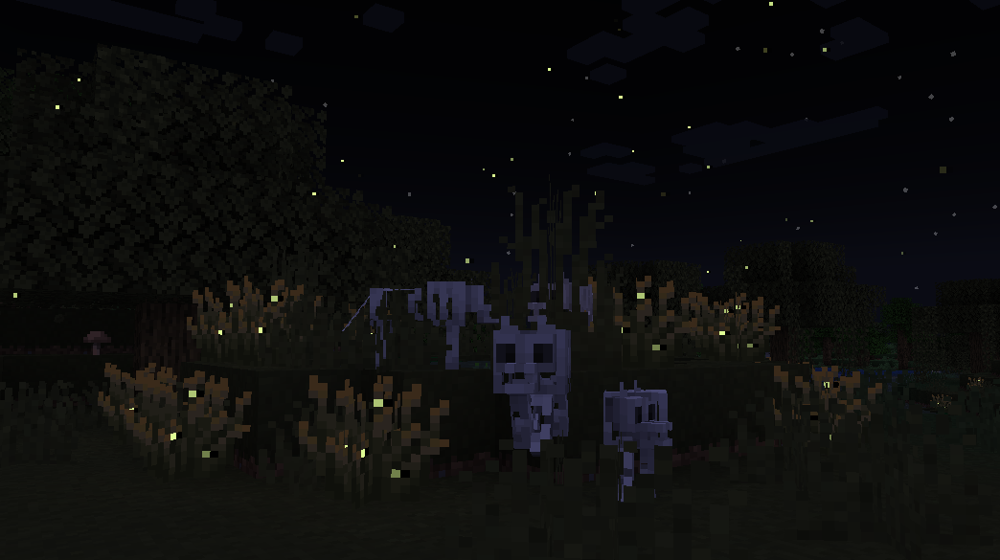

# Advanced Vanilla
## Version: Wiki-09 | RP-10 | DP-11 -- Beta 1.2 Preview 1
Advanced Vanilla is a minecraft Resourcepack and Datapack made by **@PainterFlow11** 
Updates release on [Modrinth](https://modrinth.com/resourcepack/advanced-vanilla), only experimental snapshots get released here!

> [!IMPORTANT]
> + [Advanced Vanilla on Modrinth](https://modrinth.com/resourcepack/advanced-vanilla) 
> + [Advanced Vanilla Discord](https://discord.com/invite/8rzVSF36ab) 
> + [PainterFlow11 on X](https://x.com/PainterFlow11) 

> [!WARNING] 
> Advanced Vanillas Open Source Version, 
> will not be updated until the release of beta 1.3, 
> we are planning on removing all useless vanilla assets their. 

> [!WARNING]
> Advanced Vanilla has **no** backwards compatibility, 
> if it supports a snapshot, it will __always__ support the most recent full verion 
> **The datapack currently only supports the newest snapshots, not the latest full version**

## Preview images:
### New GUI, Items and Blocks!

### New Inventory(the entire GUI has been updated btw)!

### Animal Variants!

***

Got Any Copyright Issues?
DM @painterflow11 on discord!
